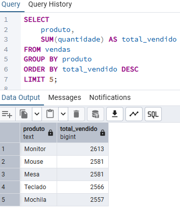

# 📸 Consultas SQL

---
🔹 Produto Mais Vendido

SELECT produto, SUM(quantidade) AS total_vendido

FROM vendas

GROUP BY produto

ORDER BY total_vendido DESC;

---

🔹 Ticket Médio

SELECT AVG(valor_total) AS ticket_medio
FROM vendas;

"Ticket Médio" (Ticket_medio.png)

---

🔹 Vendas por Cidade

SELECT cidade, SUM(valor_total) AS total_vendas
FROM vendas
GROUP BY cidade
ORDER BY total_vendas DESC;

"Cidade" (cidade.png)
